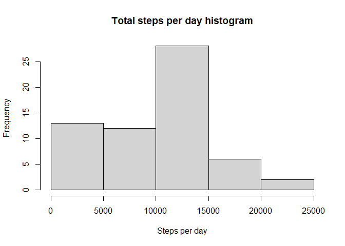
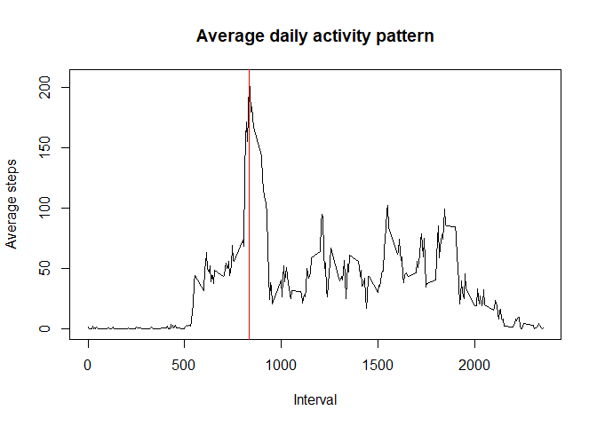
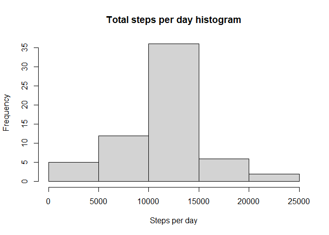

1. Loading and processing the data. This step will load an process the data we need for the analysis.

```r
library(dplyr)
```

```
## 
## Attaching package: 'dplyr'
```

```
## The following objects are masked from 'package:stats':
## 
##     filter, lag
```

```
## The following objects are masked from 'package:base':
## 
##     intersect, setdiff, setequal, union
```

```r
activ_data <- "activity.zip"
if (!file.exists(activ_data)) {
      dat_url <- "https://d396qusza40orc.cloudfront.net/repdata%2Fdata%2Factivity.zip"
      download.file(dat_url, activ_data)
}
if (!file.exists("activity.csv")) {
      unzip(activ_data)
}
## Read an assign CSV file to R Data frame
amdat <- read.csv("activity.csv")
## Change date column format
amdat$date <- as.Date(as.character(amdat$date, "%Y/%m/%d"))
```
2. Mean of total number of steps taken per day. We will proceed now calculate the total of steps per day, and then the mean.
We will first group the data set per date, and summarize the total number of steps. With this, we will plot an histogram and report the figures.

```r
gr_amdat <- group_by(amdat, date)
sperday <- summarise(gr_amdat, totsteps = sum(steps, na.rm = TRUE))

## Plot histogram
hist(sperday$totsteps, main = "Total steps per day histogram", xlab = "Steps per day")
```

<!-- -->

```r
## Calculate and report mean and median steps per day
meansteps <- mean(sperday$totsteps, na.rm = TRUE)
mediansteps <- median(sperday$totsteps, na.rm = TRUE)
meanmess <- paste("The mean steps per day is:", meansteps)
medianmess <- paste("The median steps per day is:", mediansteps)
print(meanmess)
```

```
## [1] "The mean steps per day is: 9354.22950819672"
```

```r
print(medianmess)
```

```
## [1] "The median steps per day is: 10395"
```
3. Average daily pattern activity. This code will make a time series plot of the 5 minute interval (x-axis) and the average number of steps taken, averaged across all days (y-axis). We then will identify the interval accross all days in the data sets that contains the maximum number of steps.

```r
i_pattern <- group_by(amdat, interval)
m_pattern <- summarise(i_pattern, stm = mean(steps, na.rm = TRUE))

## Find x value for max y value
amax <- max(m_pattern$stm)
smax <- as.numeric(m_pattern[which.max(m_pattern$stm), 1])
print(paste("Maximum average number of steps is:", amax, 
            "and it is found at interval:", smax))
```

```
## [1] "Maximum average number of steps is: 206.169811320755 and it is found at interval: 835"
```

```r
## Plot pattern
plot(m_pattern,  type = "l", xlab = "Interval", ylab = "Average steps", 
     main = "Average daily activity pattern")
abline(v=smax, col="red", lwd = 1.5)
```

<!-- -->
4. Imputing missing values. There are a number of days/intervals where there are missing values (coded as NA\color{red}{\verb|NA|}NA). The presence of missing days may introduce bias into some calculations or summaries of the data. We will implement a simple approach to impute the missing values using the mean for the interval.

First we will calculate nd report the total number of missing values in the dataset. Then we will create a new data set with the NAs values substituted with the imputed values, lastly we will create a histogrmam and report mean an median total number of steps per day.

4.1 Complete cases

```r
inc_cases <- sum(!complete.cases(amdat))
print(paste("Total number of missing values in the data set is:", inc_cases))
```

```
## [1] "Total number of missing values in the data set is: 2304"
```
4.2 Process data to imput values

```r
amdat_in <- inner_join(amdat, m_pattern, by = "interval")
amdat_in <- transform(amdat_in, steps = ifelse(is.na(amdat_in$steps), yes = amdat_in$stm, no = amdat_in$steps))
amdat_new <- mutate(amdat, steps = amdat_in$steps)
```
4.3 Make histogram

```r
amdat_new_gr <- group_by(amdat_new, date)
amdat_sumxday <- summarise(amdat_new_gr, totstp = sum(steps, na.rm = TRUE))
hist(amdat_sumxday$totstp, main = "Total steps per day histogram", xlab = "Steps per day")
```

<!-- -->
4.4 Calculate and report mean and median of imputed values

```r
impmean <- mean(amdat_sumxday$totstp)
impmed <- median(amdat_sumxday$totstp)
print(paste("Mean steps per day with imputed values is:", impmean))
```

```
## [1] "Mean steps per day with imputed values is: 10766.1886792453"
```

```r
print(paste("Median steps per day with imputed values is:", impmed))
```

```
## [1] "Median steps per day with imputed values is: 10766.1886792453"
```

```r
print(paste("Mean steps per day with original values is:", meansteps))
```

```
## [1] "Mean steps per day with original values is: 9354.22950819672"
```

```r
print(paste("Median steps per day with original values is:", mediansteps))
```

```
## [1] "Median steps per day with original values is: 10395"
```
4.5 Show differences in patterns of weekdays and weekends.

```r
amdat_new <- mutate(amdat_new, wday = weekdays(amdat_new$date))
amdat_new <- transform(amdat_new, wdayf = ifelse((amdat_new$wday == "sábado" | amdat_new$wday == "domingo"), 
                                                   yes = "weekend", no = "weekday"))
amdat_new <- mutate(amdat_new, wdayf = as.factor(wdayf))
amdat_new_wdays <- filter(amdat_new, amdat_new$wdayf == "weekday")
amdat_new_wends <- filter(amdat_new, amdat_new$wdayf == "weekend")
wdays_by <- group_by(amdat_new_wdays, interval)
wends_by <- group_by(amdat_new_wends, interval)

wdays_mean <- summarise(wdays_by, m = mean(steps))
wends_mean <- summarise(wends_by, m = mean(steps))

par(mfrow=c(2,1), mai = c(.5, 1, .5, .1))
plot(wdays_mean, type = "l", xlab = "Interval", ylab = "Number of steps", main = "weekdays")
plot(wends_mean, type = "l", xlab = "Interval", ylab = "Number of steps", main = "weekends")
```

<!-- -->

Conclusion: as we can se in the plot above, subjects had more activiy during weekends.

END
